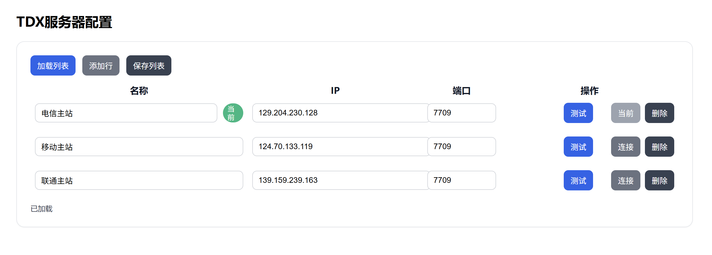

# TDX数据源管理服务

基于 pytdx 的股票数据服务，提供 REST API 与 MCP 工具接口，支持实时行情、历史数据、财务信息、板块与行业数据等。

## 功能特性

- ✅ 实时行情与批量行情
- ✅ 历史 K 线与批量历史
- ✅ 股票基本信息与市场列表
- ✅ 财务数据与公司报告
- ✅ 板块与行业数据、除权除息
- ✅ 多服务器管理：测试、选择、保存
- ✅ RESTful API + 文档（Swagger/OpenAPI）
- ✅ MCP（Model Context Protocol）工具流接口 `/mcp`
- ✅ 跨域（CORS）支持
- ✅ Docker 一键打包部署

## 安装依赖

```bash
pip install -r requirements.txt
```

## 启动服务

```bash
# 方式1: 直接运行
python main.py

# 方式2: 使用启动脚本
python start.py

# 方式3: 使用 uvicorn（推荐开发）
uvicorn main:app --host 0.0.0.0 --port 6999 --reload
```

- 服务地址：`http://localhost:6999`
- API 文档：`http://localhost:6999/docs`
- 配置管理页面：`http://localhost:6999/config`



## 服务器管理接口

- `GET /api/servers` 获取服务器列表与当前项
- `POST /api/servers` 保存服务器列表（可携带 `current_index`）
- `POST /api/server/select` 选择当前服务器
- `GET /api/server/current` 查询当前服务器
- `POST /api/server/test` 测试服务器连通性（返回 `reason: tcp_connect_failed/tdx_handshake_failed`）
- `POST /api/server/config` 以单一服务器覆盖配置并设为当前
- `GET /api/server/saved` 读取最近一次保存的配置

持久化位置：`cache/servers.json`（Docker 下挂载到 `/app/cache`）

## 主要 API 接口

- 基础：`GET /`、`GET /api/status`、`GET /api/servers`
- 实时：`GET /api/quote/{symbol}`、`POST /api/quotes`、`POST /api/quotes/batch`
- 历史：`GET /api/history/{symbol}`、`POST /api/history/batch`
- 信息：`GET /api/stock/{symbol}`、`GET /api/markets`
- 财务：`GET /api/finance/{symbol}`、`GET /api/report/{symbol}`
- 新闻：`GET /api/news`
- 板块与行业：`GET /api/blocks`、`GET /api/industries`
- 除权除息：`GET /api/xdxr/{symbol}`

## MCP 工具接口

- 路径：`http://localhost:6999/mcp`
- 已注册工具（示例）：`get_quote`、`get_quotes`、`get_history`、`get_history_batch`、`get_finance`、`get_stock_info`、`get_blocks`、`get_industries`
- 示例使用：
  - `examples/mcp_langchain_example.py`
  - `examples/mcp_langgraph_example.py`

## 使用示例

### 命令行调用示例
```bash
# 获取实时行情
curl "http://localhost:6999/api/quote/sh600000"

# 获取历史 K 线（日线：period=9）
curl "http://localhost:6999/api/history/sz000001?period=9&count=50"

# 批量实时行情
curl -X POST "http://localhost:6999/api/quotes" \
  -H "Content-Type: application/json" \
  -d '["sh600000", "sz000001", "bj430000"]'

# 批量历史 K 线
curl -X POST "http://localhost:6999/api/history/batch" \
  -H "Content-Type: application/json" \
  -d '{"symbols":["sh600000","sz000001"],"period":9,"count":50}'

# 测试服务器连通性
curl -X POST "http://localhost:6999/api/server/test" \
  -H "Content-Type: application/json" \
  -d '{"ip":"129.204.230.128","port":7709}'

# 验证服务状态
curl "http://localhost:6999/api/status"
```

### Python项目调用示例
```python
import requests
import json

class TDXClient:
    def __init__(self, base_url="http://localhost:6999"):
        self.base_url = base_url
    
    def get_quote(self, symbol):
        """获取单个股票行情"""
        response = requests.get(f"{self.base_url}/api/quote/{symbol}")
        if response.status_code == 200:
            return response.json()
        return None
    
    def get_batch_quotes(self, symbols):
        """批量获取行情"""
        response = requests.post(
            f"{self.base_url}/api/quotes",
            headers={"Content-Type": "application/json"},
            data=json.dumps(symbols)
        )
        if response.status_code == 200:
            return response.json()
        return None

# 使用示例
client = TDXClient()
quote = client.get_quote("sz000001")  # 获取平安银行行情
print(quote)

symbols = ["sh600036", "sz000002", "sh601318"]  # 招商银行, 万科A, 中国平安
quotes = client.get_batch_quotes(symbols)
print(quotes)
```

### Node.js项目调用示例
```javascript
const axios = require('axios');

class TDXClient {
    constructor(baseUrl = 'http://localhost:6999') {
        this.baseUrl = baseUrl;
    }
    
    async getQuote(symbol) {
        try {
            const response = await axios.get(`${this.baseUrl}/api/quote/${symbol}`);
            return response.data;
        } catch (error) {
            console.error('获取行情失败:', error.message);
            return null;
        }
    }
    
    async getBatchQuotes(symbols) {
        try {
            const response = await axios.post(
                `${this.baseUrl}/api/quotes`,
                symbols,
                { headers: { 'Content-Type': 'application/json' } }
            );
            return response.data;
        } catch (error) {
            console.error('批量获取行情失败:', error.message);
            return null;
        }
    }
}

// 使用示例
async function main() {
    const client = new TDXClient();
    
    const quote = await client.getQuote('sz000001');
    console.log(quote);
    
    const symbols = ['sh600036', 'sz000002', 'sh601318'];
    const quotes = await client.getBatchQuotes(symbols);
    console.log(quotes);
}

main();
```
```

## Docker 部署

```bash
# 构建镜像
docker build -t tdxmcp:1.0 .

# 运行容器（宿主 6999 -> 容器 6999）
docker run -d --name tdxmcp -p 6999:6999 tdxmcp:1.0

# 持久化服务器列表到宿主机（推荐）
docker run -d --name tdxmcp -p 6999:6999 -v %CD%/cache:/app/cache tdxmcp:1.0

# 自定义端口（通过环境变量 PORT）
docker run -d --name tdxmcp -e PORT=8080 -p 8080:8080 tdxmcp:1.0
```

镜像说明：
- 入口：`uvicorn main:app --host 0.0.0.0 --port ${PORT:-6999}`
- 暴露端口：`6999`
- 卷：`/app/cache`（保存 `servers.json`）

## 配置说明

- 配置页面：`/config` 可视化管理服务器列表（测试、选择、保存）
- 服务器列表持久化：`cache/servers.json`
- 文本配置：`config.py` 可调整服务器默认列表、参数限制与市场映射

## 股票代码格式

- 上海：`sh600000` 或 `600000`
- 深圳：`sz000001` 或 `000001`
- 北京：`bj830000` 或 `830000`

## K 线周期参数

| 参数值 | 周期说明 |
|--------|----------|
| 0 | 5分钟 |
| 1 | 15分钟 |
| 2 | 30分钟 |
| 3 | 1小时 |
| 4 | 日线 |
| 5 | 周线 |
| 6 | 月线 |
| 7 | 年线 |
| 8 | 1分钟 |
| 9 | 日线 |
| 10 | 季度线 |

## 注意事项

1. 确保网络可访问 TDX 服务器端口（通常为 `TCP/7709`）
2. 批量查询建议不超过 100 支股票（可通过 MCP/REST 分批）
3. 历史数据建议不超过 1000 条/次（可分页或分批）
4. 连接失败时可切换服务器或使用测试接口诊断（`reason` 字段）
5. 跨域已启用，前端可直接调用 REST 接口

## 使用声明与免责声明

- 本项目仅用于学习与研究目的，不构成任何投资建议。
- 服务返回的数据来源于第三方，真实性、准确性、完整性不作保证。
- 使用者应遵守相关法律法规与数据使用规范，因使用本项目造成的任何后果由使用者自行承担。

## 开发扩展

- 基于 FastAPI，可扩展新接口与认证
- 可加入缓存与数据库存储
- 提供示例与测试脚本（见 `examples/` 与 `tests/`）

## 许可协议

- 本项目采用 MIT 开源许可协议，详见仓库根目录 `LICENSE` 文件。
